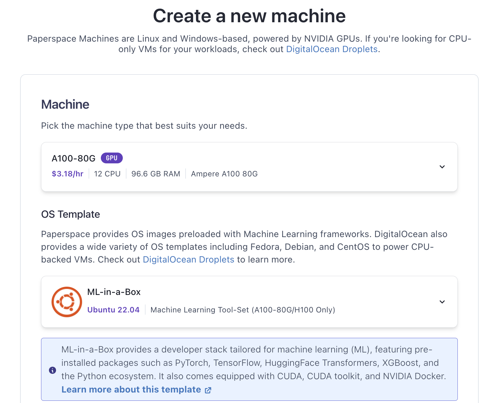

# NeMoOpenFoldLangChain

NeMo OpenFold LangChain for NVIDIA GenAI Contest

<https://www.nvidia.com/en-us/ai-data-science/generative-ai/developer-contest-with-langchain/terms-and-conditions/>

## Step 1: Set Up Your Environment

1. **Hardware Requirements**: Ensure you have access to NVIDIA GPUs, ideally A100, to run the models efficiently. In my case I rent A100 GPU from Digital Ocean Paperspace. Please see the screenshot. Disk Size: 1TB

   

   ```bash
   ssh paperspace@184.105.4.23
   ```

1. **venv**:
   ```bash
   cd ~
   python3.11 -m venv venv
   source venv/bin/activate
   ```
1. First resolve **YouTokenToMe Cython** issue:

   ```bash
   cd ~
   git clone https://github.com/aidatatools/NeMoOpenFoldLangChain.git
   cd NeMoOpenFoldChain
   cd YouTokenToMe
   pip install -e .
   ```

1. **NeMo Toolkit**:

   ```bash
   cd ~
   cd NeMoOpenFoldChain
   #pip install pybind11
   #pip install wheel setuptools pip --upgrade
   #pip install fasttext
   pip install "nemo_toolkit[all]"
   ```
